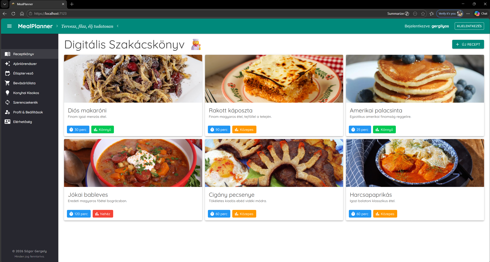

# 🍽️ MealPlanner App

> *"Plan, cook, live consciously."*

## 📖 About The Project

MealPlanner is a comprehensive, full-stack **Blazor WebAssembly** application designed to make everyday cooking, meal planning, and grocery shopping effortless. 

Going beyond a simple recipe manager, it acts as a *smart digital kitchen assistant*. By integrating **OpenAI**, the application provides highly personalized meal recommendations based strictly on the user's own recipe collection and customized dietary restrictions (allergies, vegan, gluten-free, etc.).

## ✨ Key Features

* **🔐 Secure User Authentication:** Individual user accounts with secure login and registration. All data (recipes, plans, preferences) is private and user-specific.
* **📖 Digital Recipe Book:** Save, view, and manage your favorite recipes with images, preparation times, difficulty levels, and categorized ingredients.
* **🤖 Smart AI Kitchen Assistant:** An OpenAI-powered chatbot that acts as your personal chef. It answers questions and suggests meals exclusively from *your* recipe book, strictly adhering to your saved dietary preferences and allergies.
* **📅 Weekly Meal Planner:** A highly visual and intuitive tool to schedule your breakfasts, lunches, and dinners for the entire week.
* **🛒 Automated Shopping List:** Dynamically generates a categorized grocery list (Meat, Dairy, Veggies, etc.) based on your weekly meal plan. Includes a one-click "Clear List" function once you're done shopping.
* **💡 Kitchen Guide:** Built-in handy tools including a unit converter (Cups/Spoons to Grams), an ingredient substitute cheat sheet, and a perfect cooking time guide.
* **🎲 "What to cook today?" (Wheel of Fortune):** Can't decide what to eat? Let the app randomly pick a recipe from your collection with a fun, animated UI.
* **⚙️ Profile & Dietary Settings:** Highly customizable user profiles where you can set dietary restrictions (Vegan, Vegetarian, Gluten-free, Lactose-free) and specifically list disliked ingredients or allergies (e.g., "peanuts", "mushrooms").
* **📱 Responsive Modern UI:** Built with **MudBlazor**, ensuring a beautiful, Material Design-inspired interface that looks great on both desktop and mobile devices.

## 🛠️ Built With

This project leverages the modern .NET ecosystem for a seamless Full-Stack C# experience:

* **Frontend:** Blazor WebAssembly (WASM), HTML/CSS
* **Backend:** ASP.NET Core Web API (.NET 8), C#
* **Database:** Entity Framework Core, SQL Server
* **UI Component Library:** MudBlazor
* **AI Integration:** OpenAI API (`gpt-4o-mini` model)

## 🚀 Getting Started

To get a local copy up and running, follow these simple steps.

### Prerequisites
* [.NET 8 SDK](https://dotnet.microsoft.com/download/dotnet/8.0)
* Visual Studio 2022 (or VS Code)
* An active OpenAI API Key
